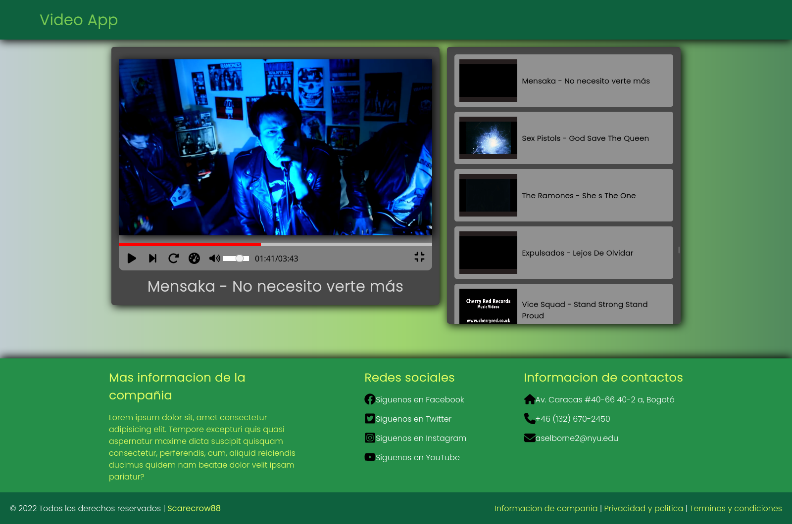
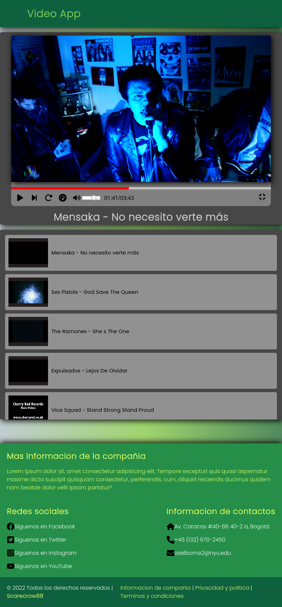
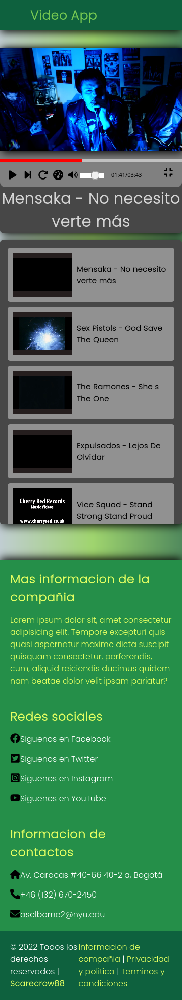

# Video List App JavaScript CSS HTML
## Funcionalidades
- Reproduce video
- Pausa video
- Repetir video
- Barra de carga de video
- Barra de volumen
- Lista de reproduccion
## Tecnologías utilizadas
- **Frontend:** JavaScript, HTML, CSS
## Arquitecturas
- Monolitica
> Vista 1 de la pagina  
  
> Vista 2 de la pagina  
  
> Vista 3 de la pagina  
  
# **Nota:** Antes de salir, pasate a ver las branches